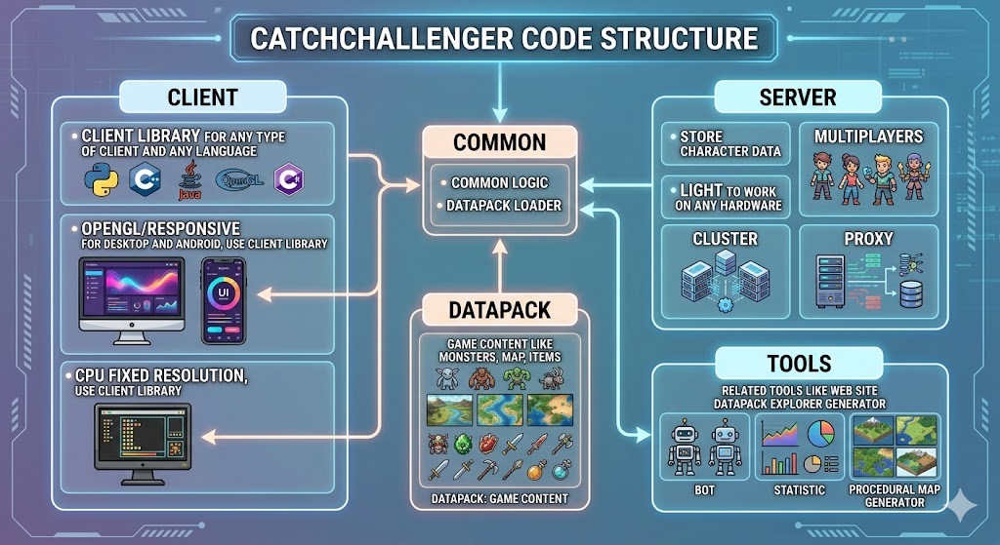

# Intro

http://catchchallenger.first-world.info/



This game is a MMORPG, Lan game and a single player game. It's mix of pokemon for the RPG part, crafting/clan/TvT, industry. Modular datapck.

## License
client/tiled/ is extracted version of http://www.mapeditor.org/, https://github.com/bjorn/tiled
libogg and fileopus is extracted from other project
Interface UI is from bought template (then under copyright)

# Target
- minimal dependency (searcg dependency hell, bug/security problem in dependency)
- no bloatware (no stupid features, no features used for only 1 person if imply lot of code or dangerous code, no unrelated features)
- async, support high latency, very low bandwidth (tipical of TOR/I2P)
- send datapack by internal protocol (overall compression to group similar part into multiple file) and http mirror, and when datapack is downloaded by client can be used to mount new server with same datapack
- most processing is cliend side

## Compiling

Use **C++20**, maybe considering C++23 for std::flat_map for datapack in memory data (it's RO data)

Dependency:
* zlib (can be disabled but it's for tiled map editor). zstd
* blake3 to have maximal performance and be future proof to replace sha224
* xxh to have light check for what file have changed, eg truncated to 32Bits datapack file list
* Client
  * Qt openssl enabled to have QSslSocket or QtWebSocket, QThread
* Server
  * Qt if generic server + Qt SQL drivers (mysql, sqlite for game solo, postgresql)
  * libpq (postgresql in async) or raw binary file
* Gateway
  * curl to download datapack via http

### Client

```sh
cd client/
qmake *.pro
make
mkdir datapack
cd datapack
git clone --depth=1 https://github.com/alphaonex86/CatchChallenger-datapack internal
chmod a+x catchchallenger
./catchchallenger
```

# Sources
* The sources of the client/server: https://github.com/alphaonex86/CatchChallenger
* The sources of the datapack: https://github.com/alphaonex86/CatchChallenger-datapack
