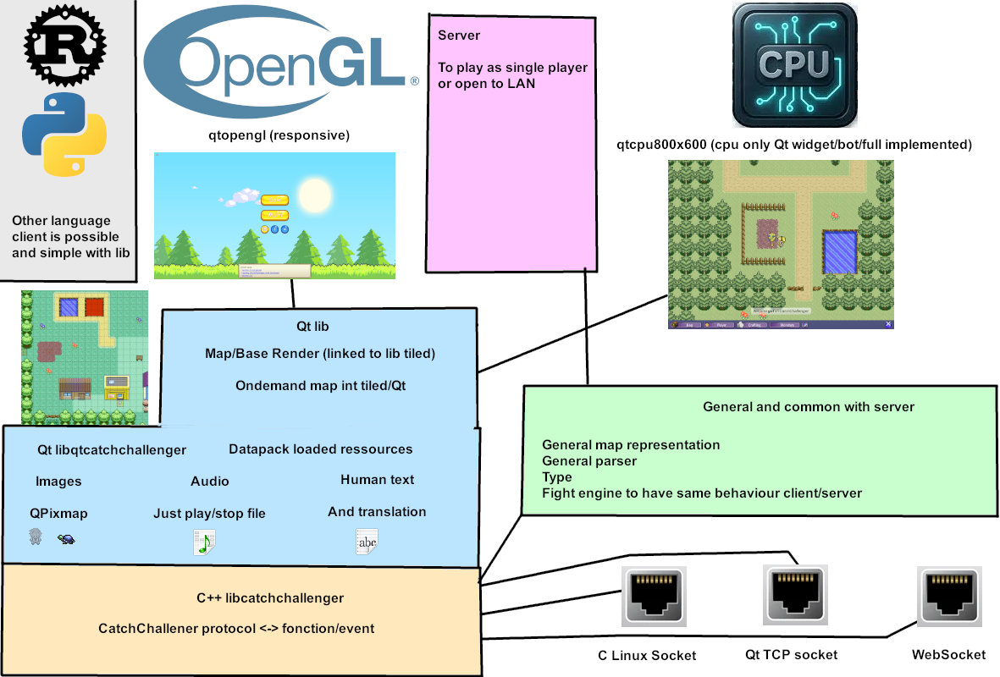

# CPU client
*qtcpu800x600* folder, do into Qt widget + Qgraphicview, simple to modify via Qt creator

# GPU client
*qtopengl* folder, use OpenGL, responsive, mean auto change the content with the given resolution, perfect for smartphone

# lib
* *libcatchchallenger* C++ lib, just to convert binary protocol to function call, and parse datapack to in memory contant, should be able to be used as rust, python, ... lib
* *libqtcatchchallenger* Qt lib, used to load more advanced content like images/sound via Qt to don't have to do the work into Qt client
* *qtmaprender* the map view for QGraphicView, put in sprite the bots, do the animations of the sprite, move on the map, do the map change, the pathfinding, show the other player and estimate where are and their move animation
