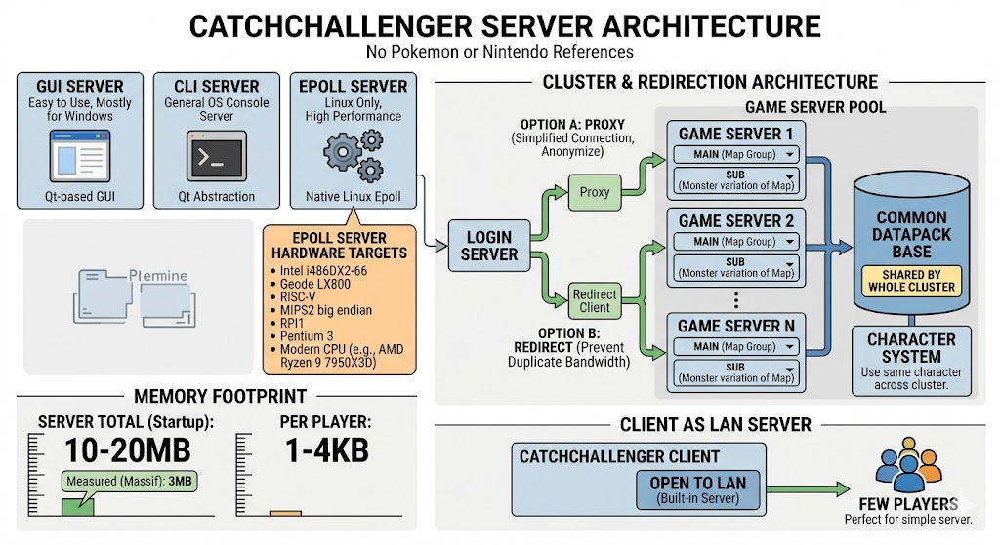

# Gui server
```sh
cd server/
qmake catchchallenger-server-gui.pro
make
git clone --depth=1 https://github.com/alphaonex86/CatchChallenger-datapack datapack
```

# CLI server
```sh
cd server/
qmake catchchallenger-server-cli.pro
make
git clone --depth=1 https://github.com/alphaonex86/CatchChallenger-datapack datapack
```

# Epoll server (linux only, high performance)
**Ubuntu**: apt-get install libzstd-dev zlib1g-dev libssl-dev libpq-dev

**Debian stretch**: apt-get install build-essential gcc automake qt5-qmake libzstd-dev zlib1g-dev libssl-dev libpq-dev qttools5-dev

```sh
cd server/
qmake catchchallenger-server-cli-epoll.pro
make
git clone --depth=1 https://github.com/alphaonex86/CatchChallenger-datapack datapack
chmod a+x catchchallenger-server-cli-epoll
./catchchallenger-server-cli-epoll
```

## Hardware server for Epoll server
Tested on physical hardware:
* Intel i486DX2-66 at 66Mhz for x86
* Geode LX800 (i486/i586 like) at 500MHz for x86
* RISC-V (without SIMD)
* MIPS2 big endian a 200MHz
* RPI1 at 700MHz 32-bit for ARM11
* Pentium 3 at 750MHz for x86
Without problem with 200 players.
And of course more modern CPU like AMD Ryzen 9 7950X3D 16-Core Processor in x86_64, all qemu arch

The server is actually 10-20MB of memory (3MB measured by massif) and 1-4KB by player

## cluster
You can have multiple game server. Whole cluster need same datapack base, but each gameserver select their main (map group), and sub (monster variation of map)

You can use same character into same game server group.

The login server can act as proxy to do connecion more simple and better anonimate or just redirect the cliente to prevent duplicate bandwith between login and game server.

Can have multiple login server to filter DDOS attack.

# client as server
The client can be open to lan, then perfect to simple server for few player
